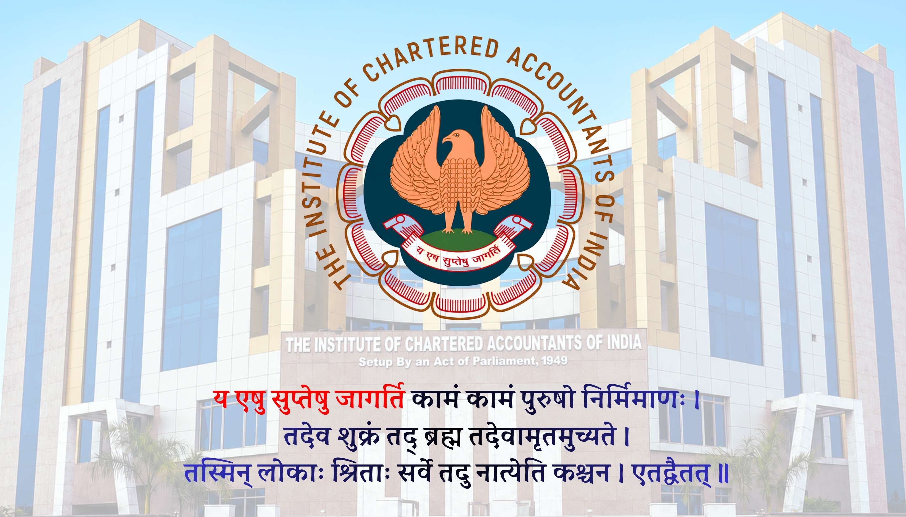

<html lang="en">
<head>
<meta charset="UTF-8">
<meta name="viewport" content="width=device-width, initial-scale=1.0">
<title>Vedant Digital Card</title>

<link rel="stylesheet" href="https://cdnjs.cloudflare.com/ajax/libs/font-awesome/6.5.0/css/all.min.css">

</head>

<body>

    

    

        
        

            <h2>Mr. Vedant Kalbande</h2>
			
CA Finalist

            
Institute of Chartered Accountants of India

        

    

    
Save Contact

    <i class="fa-solid fa-phone-volume" style="color:gold;"></i> Call
    <i class="fa-solid fa-angle-right" style="color:gold;"></i>

    <i class="fa-brands fa-whatsapp" style="color:gold;"></i> WhatsApp
    <i class="fa-solid fa-angle-right" style="color:gold;"></i>

    <i class="fa-brands fa-instagram" style="color:gold;"></i> Instagram
    <i class="fa-solid fa-angle-right" style="color:gold;"></i>

    
        <i class="fa-brands fa-youtube" style="color:gold;"></i>
        YouTube
    
    <i class="fa-solid fa-angle-right" style="color:gold;"></i>

    <i class="fa-brands fa-linkedin" style="color:gold;"></i> LinkedIn
    <i class="fa-solid fa-angle-right" style="color:gold;"></i>

    <i class="fa-solid fa-envelope" style="color:gold;"></i> Email
    <i class="fa-solid fa-angle-right" style="color:gold;"></i>

    <i class="fa-solid fa-globe" style="color:gold;"></i> Website
    <i class="fa-solid fa-angle-right" style="color:gold;"></i>

    <i class="fa-solid fa-map" style="color:gold;"></i> Location
    <i class="fa-solid fa-angle-right" style="color:gold;"></i>

    

</body>
</html>

